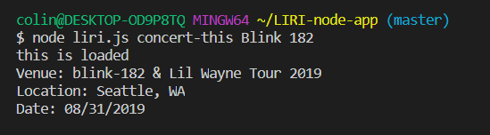
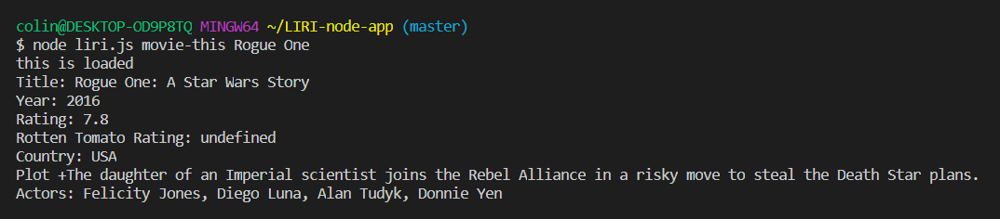
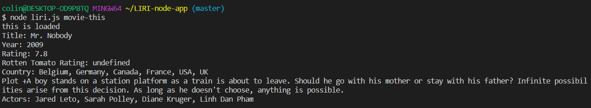
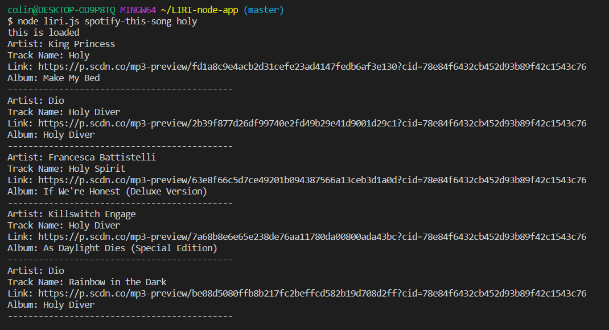
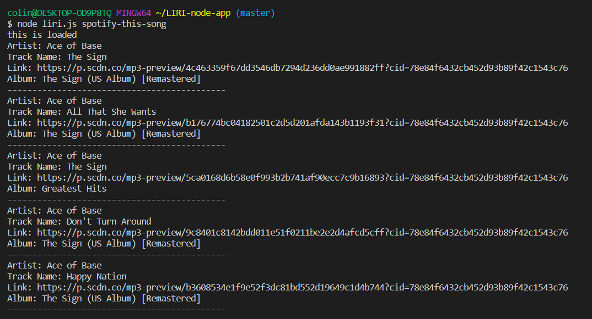

# LIRI-node-app

## Installation
* Install node along with necessary packages.
* Create necessary API keys to use Spotify, OMDB, and Bands In Town

## Instructions
The application can take in one of four commands;

### Concert-this
This will locate the next concert for the band you input.

Input:
```
BASH: node liri.js concert-this Blink 182
```
Output:



### Movie-this
This command will provide information about the selected movie.

Input:
```
BASH: node liri.js movie-this Rogue One
```
Output: 



If nothing is entered as a search value, the app will default to the film "Mr. Nobody".

"Mr. Nobody" Output:



### Spotify-this-song
This will provide information on a song and provide up to 5 results.

Input:
```
BASH: node liri.js spotify-this-song
```
Output:



This command will provide info on the song "The Sign" by default, if nothing is searched
Output:




### Do-what-it-says
This command will run one of the 3 commands above with a pre-determined search value held in a text file. You can edit the text file to change the functionality on this command.

Input:
```
BASH: node liri.js do-what-it-says
```
Output:


